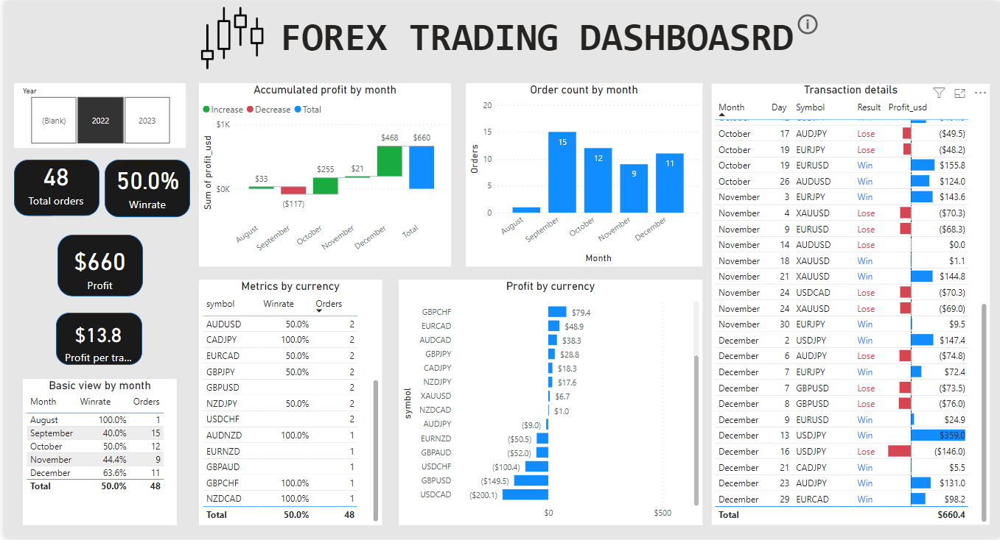
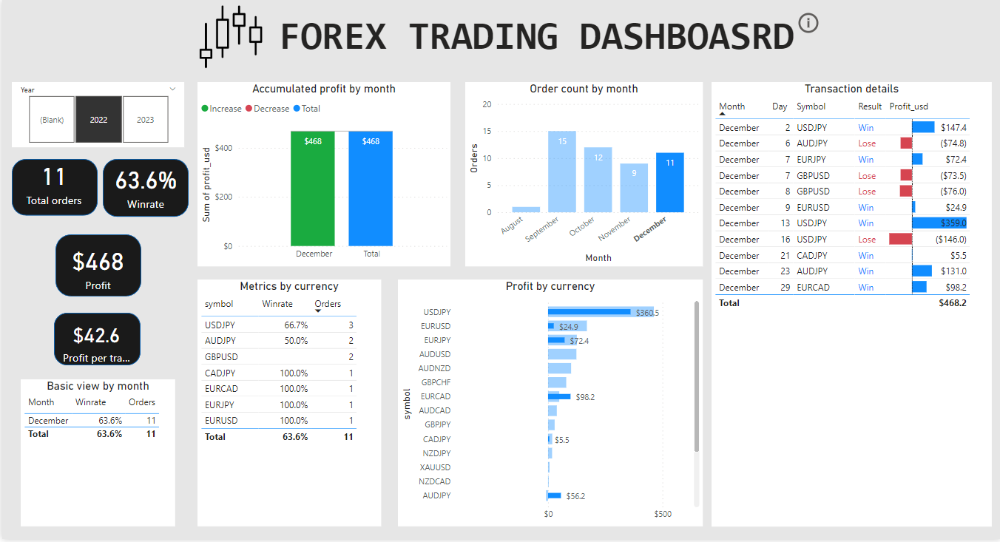

# Automated Trading Dashboard for Day Trader

## Overview

Create an automatic dashboard to help track the performance of a day trader's behavior in the Forex market though important metrics. 

Through the dashboard, it helps the owner manage his discipline, and save time in performance tracking.

It offers a brief overview of key metrics in the trading market at first glance.

In addition to key metrics being calculated, the dashboard includes the transaction details in summary if the viewer wants to have more details of past transactions. 

{alt="Performance of a trader in the year 2022" width="679"}

## Tools used for this project:

Power BI

I used this tool for these work: extracting, transforming, and data loading from CSV flat file. Then, I calculated the number important metrics and visualize them on charts.

Some important concepts in Power BI related to this work:

- Calculated field with DAX

- Data modeling

- Filtering options

- Conditional formating

## Behavioral Analytics:

Tracking and analysis of key metrics over time (historical trading patterns and behaviors).

Graphical representation of performance trends over time.

Identification of key performance metrics:

-   `Total orders`

-   `Winrate`

-   `Total profit`

-   `Accumulated profit by month`

-   `Profit by currency`

These are key important numbers needed to perform calculation to help traders understand their performance in the market.

## Data collection

There are many ways to connect to data sources:

-   `Flat files: CSV, Txt files,...`

-   `Database`

-   `API gateway,`

-   `Web crawling,..`

Depending on the requirement, I would use a suitable tool to handle the problem.

The requirement of this case is to extract data from a flat file. One of the reasons is that the platform provider offered a complete data set of the trader when doing transactions.

## Data visualization by Power BI platform

The dashboard shows the comprehensive overview of past performance data from a trader.

Dashboard components:

1. Slider for Year

2. Cards for key metrics (Total orders, Winrate, Profit, Profit per trade)

3. Waterfall chart for `Accumulated profit by month`

4. Bar chart for `Order count by month`

5. Horizontal bar chart for `Profit by currency`

6. Summary tables for `Basic view by month`, `Metrics by currency`, `Transaction details`

It provides crucial metrics empowering the trader with essential information for decision-making, and discipline management. These metrics are included such as `Total orders`, `Winrate`, `Profit`, `Profit by currency`,...

Among various charts featured this dashboard, two are particularly important to consider.

The first one is `Basic view by month`, illustrating the actual win rate over time when a trader implements his trading strategy in the market. In this case, the trader performs exceptionally and consistently between August and December. The overall winrate of these 5 months is around 50%. 

The second one is `Profit by currency`. It shows the most and the least amount of profit the trader has earned among different currency. This information assists the trader in identifying the currency suitable for his strategy, and find the worst one to eliminate from his trading products, thereby improving the overall trading performance. 

{width="679"}

In summary, the trader performs well in the market with the performance data shown in 2022, with the profit of 660$. 
